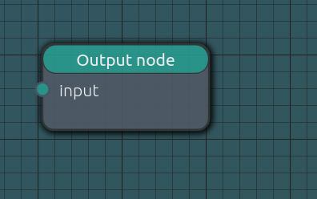

#NodeOverflow 

#### NodeOverflow is web application using flow programming concept for image processing
This project is split into to repositories: this one containing 
application frontend and the other one containing backend.
Second repository can be found under this link: 
https://github.com/Harry29-exe/NodeOverflow-backend

##Application functionality

### Node based image editor

###Input node
It loads image from given location and is input to whole system.

###Output node
It's role is to be output of the system and from it, parser start
interpreting node structure.

###Connecting nodes
To connect nodes user need to click on output dot of input node and drag it
to input dot of output node.

###Loading image and rendering it
User can select image just by pressing "Image not loaded" button in the input node.
To render it user need to press render button in display panel.

###Node shelve
More nodes can be dropped from node shelve on the left side of the screen

###Filter nodes
Many filter nodes can be combined to create interesting results.

###Other functions
More over application supports:
- registering/logging users
- storing/loading users' projects
- searching through user's projects